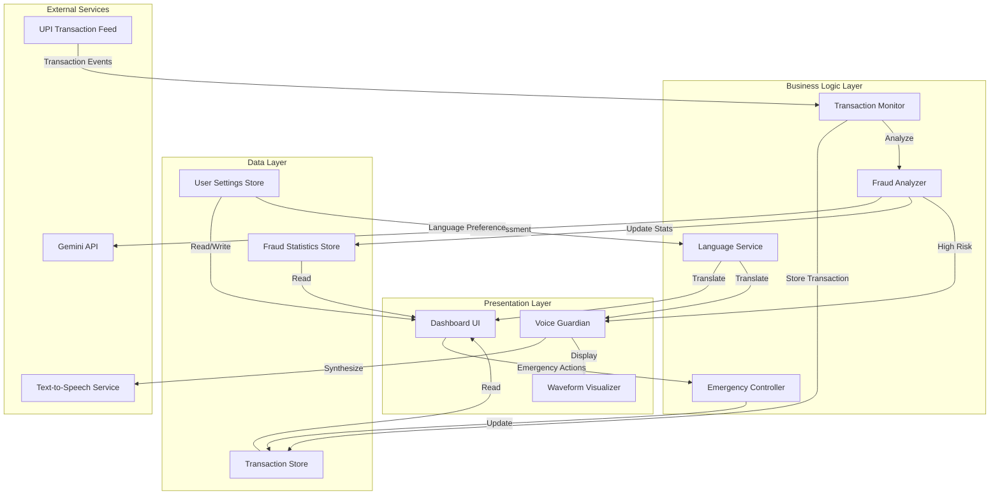

# Design Document: Sahi-UPI AI Guardian

## Overview

Sahi-UPI AI Guardian is a real-time fraud protection dashboard for UPI transactions targeting rural and non-tech-savvy Indian users. The system combines AI-powered fraud detection using the Gemini API with accessible voice warnings and bilingual support (English/Telugu). The architecture emphasizes real-time responsiveness, clear visual communication, and accessibility for users with limited technical literacy.

The system follows a three-layer architecture:
1. **Presentation Layer**: React-based dashboard with real-time updates
2. **Business Logic Layer**: Fraud detection engine with Gemini API integration
3. **Data Layer**: Transaction storage and monitoring

## Architecture

### System Components



### Data Flow

1. **Transaction Ingestion**: UPI transactions arrive via webhook or polling mechanism
2. **Real-time Analysis**: Each transaction is immediately analyzed by the Fraud Analyzer
3. **Risk Scoring**: Gemini API evaluates transaction patterns and returns risk assessment
4. **Classification**: Transactions are classified as Verified (<70%), Suspicious (70-90%), or Blocked (>90%)
5. **Alert Generation**: High-risk transactions trigger Voice Guardian warnings
6. **UI Update**: Dashboard updates in real-time via WebSocket or polling
7. **User Action**: Users can report fraud or freeze account via Emergency Controller

## Components and Interfaces

### 1. Transaction Monitor

**Responsibility**: Capture and track UPI transactions in real-time

**Interface**:
```typescript
interface TransactionMonitor {
  // Capture a new transaction from UPI feed
  captureTransaction(transaction: UPITransaction): Promise<void>
  
  // Get recent transactions (up to 50)
  getRecentTransactions(limit: number): Promise<Transaction[]>
  
  // Subscribe to transaction updates
  onTransactionUpdate(callback: (transaction: Transaction) => void): Unsubscribe
}

interface UPITransaction {
  id: string
  amount: number
  currency: string
  recipient: string
  recipientUPI: string
  timestamp: Date
  metadata: Record<string, any>
}
```

### 2. Fraud Analyzer

**Responsibility**: Evaluate transactions using AI and assign risk scores

**Interface**:
```typescript
interface FraudAnalyzer {
  // Analyze a transaction and return risk assessment
  analyzeTransaction(transaction: Transaction): Promise<FraudAnalysis>
  
  // Detect specific scam patterns
  detectQRCodeScam(transaction: Transaction): Promise<boolean>
}

interface FraudAnalysis {
  transactionId: string
  riskScore: number // 0-100
  status: 'Verified' | 'Suspicious' | 'Blocked'
  senseThinkAct: {
    sense: string // What was detected
    think: string // AI reasoning
    act: string // Recommended action
  }
  reasoning: {
    english: string
    telugu: string
  }
  detectedPatterns: string[]
  timestamp: Date
}
```

### 3. Voice Guardian

**Responsibility**: Generate and play audio warnings for high-risk transactions

**Interface**:
```typescript
interface VoiceGuardian {
  // Generate audio warning for a fraud analysis
  generateWarning(analysis: FraudAnalysis, language: 'en' | 'te'): Promise<AudioWarning>
  
  // Play audio warning with visual feedback
  playWarning(warning: AudioWarning): Promise<void>
  
  // Check if audio alerts are enabled
  isEnabled(): boolean
}

interface AudioWarning {
  audioUrl: string
  duration: number
  captions: {
    english: string
    telugu: string
  }
  waveformData: number[] // For visualization
}
```

### 4. Dashboard UI

**Responsibility**: Display security status, transactions, and fraud analysis

**Key Components**:

**Hero Header**:
```typescript
interface SecurityStatus {
  status: 'Protected' | 'Alert'
  usersProtected: number
  lastUpdated: Date
}

// Component displays status with pulse animation for "Protected"
// Uses Safety Green for Protected, Alert Red for Alert
```

**Transaction Feed**:
```typescript
interface TransactionFeedItem {
  transaction: Transaction
  analysis: FraudAnalysis
  displayStatus: {
    label: string // Localized
    color: 'green' | 'red'
    icon: LucideIcon
  }
}

// Displays up to 50 transactions in reverse chronological order
// Updates in real-time without page refresh
```

**AI Fraud Analysis Panel**:
```typescript
interface FraudAnalysisPanel {
  selectedTransaction: Transaction | null
  analysis: FraudAnalysis | null
  
  // Displays Sense-Think-Act breakdown
  // Shows Risk Score with visual indicator
  // Presents reasoning in selected language
}
```

**Voice Guardian Display**:
```typescript
interface VoiceGuardianDisplay {
  isPlaying: boolean
  waveformData: number[]
  captions: {
    english: string
    telugu: string
  }
  
  // Shows waveform animation when audio is playing
  // Displays synchronized bilingual captions
}
```

**Emergency Action Center**:
```typescript
interface EmergencyActions {
  onReportFraud: (transactionId: string) => Promise<void>
  onFreezeAccount: () => Promise<void>
  
  // Requires confirmation for Freeze Account
  // Shows success messages in selected language
}
```

### 5. Emergency Controller

**Responsibility**: Handle fraud reports and account freezing

**Interface**:
```typescript
interface EmergencyController {
  // Report a fraudulent transaction
  reportFraud(transactionId: string, userId: string): Promise<FraudReport>
  
  // Initiate account freeze
  freezeAccount(userId: string, reason: string): Promise<FreezeResult>
  
  // Confirm emergency action (prevents accidental activation)
  confirmAction(actionId: string): Promise<boolean>
}

interface FraudReport {
  reportId: string
  transactionId: string
  userId: string
  timestamp: Date
  status: 'Submitted' | 'UnderReview' | 'Resolved'
}

interface FreezeResult {
  success: boolean
  freezeId: string
  timestamp: Date
  message: {
    english: string
    telugu: string
  }
}
```

### 6. Language Service

**Responsibility**: Provide bilingual support for all UI text

**Interface**:
```typescript
interface LanguageService {
  // Get current language preference
  getCurrentLanguage(): 'en' | 'te'
  
  // Set language preference (persisted)
  setLanguage(language: 'en' | 'te'): Promise<void>
  
  // Translate a key to current language
  translate(key: string): string
  
  // Get translations for both languages
  getBilingual(key: string): { english: string; telugu: string }
}
```

### 7. Monitoring Dashboard

**Responsibility**: Display fraud trends and statistics

**Interface**:
```typescript
interface MonitoringDashboard {
  // Get fraud statistics for date range
  getFraudStats(startDate: Date, endDate: Date): Promise<FraudStats>
  
  // Get daily trend data for charts
  getTrendData(days: number): Promise<TrendData[]>
}

interface FraudStats {
  totalTransactions: number
  verifiedCount: number
  suspiciousCount: number
  blockedCount: number
  usersProtected: number
  fraudAttempts: number
}

interface TrendData {
  date: Date
  verified: number
  suspicious: number
  blocked: number
}
```

## Data Models

### Transaction

```typescript
interface Transaction {
  id: string
  amount: number
  currency: string
  recipient: string
  recipientUPI: string
  timestamp: Date
  status: 'Verified' | 'Suspicious' | 'Blocked'
  riskScore: number
  metadata: Record<string, any>
}
```

### User Settings

```typescript
interface UserSettings {
  userId: string
  language: 'en' | 'te'
  audioAlertsEnabled: boolean
  notificationPreferences: {
    suspicious: boolean
    blocked: boolean
    verified: boolean
  }
  lastUpdated: Date
}
```

### Fraud Statistics

```typescript
interface FraudStatistics {
  date: Date
  totalTransactions: number
  verifiedCount: number
  suspiciousCount: number
  blockedCount: number
  scamPatternsDetected: {
    qrCodeScam: number
    phishing: number
    other: number
  }
}
```

## Gemini API Integration

### Risk Assessment Prompt Structure

The Fraud Analyzer sends structured prompts to Gemini API:

```typescript
interface GeminiPrompt {
  transaction: {
    amount: number
    recipient: string
    timestamp: string
    metadata: any
  }
  context: {
    userHistory: Transaction[]
    knownScamPatterns: string[]
    regionalContext: 'rural_india'
  }
  instructions: string // Request for Sense-Think-Act analysis
}
```

**Prompt Template**:
```
Analyze this UPI transaction for fraud risk:

Transaction Details:
- Amount: ₹{amount}
- Recipient: {recipient}
- Time: {timestamp}
- Metadata: {metadata}

User Context:
- Recent transactions: {userHistory}
- Location: Rural India
- User profile: Non-tech-savvy

Known Scam Patterns:
{knownScamPatterns}

Provide analysis in this format:
1. SENSE: What transaction attributes did you detect?
2. THINK: What fraud patterns or risks do you identify?
3. ACT: What action should be taken?

Return:
- Risk Score (0-100)
- Reasoning in simple English
- Reasoning in Telugu
- Detected patterns
```

### Response Parsing

```typescript
interface GeminiResponse {
  riskScore: number
  sense: string
  think: string
  act: string
  reasoning: {
    english: string
    telugu: string
  }
  detectedPatterns: string[]
}

// Parser extracts structured data from Gemini's response
function parseGeminiResponse(response: string): GeminiResponse
```

## Voice Synthesis

### Text-to-Speech Integration

The Voice Guardian uses a TTS service (e.g., Google Cloud TTS, Azure TTS) with support for:
- English (Indian accent)
- Telugu language

**Warning Message Templates**:

English:
```
"Alert! Suspicious transaction detected. Amount: {amount} rupees to {recipient}. Risk score: {score} percent. {reasoning}. Please verify before proceeding."
```

Telugu:
```
"హెచ్చరిక! అనుమానాస్పద లావాదేవీ గుర్తించబడింది. మొత్తం: {amount} రూపాయలు {recipient}కి. రిస్క్ స్కోర్: {score} శాతం. {reasoning}. దయచేసి కొనసాగే ముందు ధృవీకరించండి."
```

### Waveform Visualization

```typescript
interface WaveformVisualizer {
  // Generate waveform data from audio
  generateWaveform(audioUrl: string): Promise<number[]>
  
  // Animate waveform during playback
  animateWaveform(waveformData: number[], duration: number): void
}

// Waveform data: array of amplitude values (0-1) for visualization
// Displayed as animated bars synchronized with audio playback
```


## Correctness Properties

A property is a characteristic or behavior that should hold true across all valid executions of a system—essentially, a formal statement about what the system should do. Properties serve as the bridge between human-readable specifications and machine-verifiable correctness guarantees.

### Property 1: Risk Score Valid Range

*For any* transaction analysis, the generated Risk_Score should be between 0 and 100 (inclusive).

**Validates: Requirements 2.2**

### Property 2: Risk Score Classification Boundaries

*For any* transaction with a risk score, the classification should be:
- "Verified" when risk score < 70
- "Suspicious" when risk score >= 70 and <= 90
- "Blocked" when risk score > 90

**Validates: Requirements 2.3, 2.4, 2.5**

### Property 3: Bilingual Fraud Analysis

*For any* fraud analysis result, both the English and Telugu reasoning fields should be non-empty strings.

**Validates: Requirements 2.7, 3.5**

### Property 4: QR Code Scam Detection

*For any* transaction containing QR code scam indicators (e.g., suspicious QR metadata, unusual recipient patterns), the AI_Fraud_Analyzer should flag it with elevated risk score or include "QR_Code_Scam" in detected patterns.

**Validates: Requirements 2.6**

### Property 5: Transaction Display Completeness

*For any* transaction rendered in the UI, the output should contain all required fields: amount, recipient, timestamp, status tag, and risk score percentage.

**Validates: Requirements 1.2, 10.1, 10.5**

### Property 6: Transaction Chronological Ordering

*For any* list of transactions displayed in the UI, they should be ordered by timestamp in descending order (most recent first).

**Validates: Requirements 1.3**

### Property 7: Transaction History Retention

*For any* sequence of more than 50 transactions stored in the system, querying recent transactions should return at least the 50 most recent transactions.

**Validates: Requirements 1.5**

### Property 8: Sense-Think-Act Completeness

*For any* fraud analysis displayed in the UI, the rendered output should contain all three stages: sense (detected attributes), think (reasoning), and act (recommended action).

**Validates: Requirements 3.1, 3.2, 3.3**

### Property 9: Voice Warning Language Matching

*For any* user with a language preference set to English or Telugu, audio warnings generated by Voice_Guardian should be synthesized in that selected language.

**Validates: Requirements 4.2**

### Property 10: Audio Playback Visual Feedback

*For any* audio warning being played, the Dashboard_UI should display both waveform data (non-empty array) and bilingual captions (both English and Telugu strings present).

**Validates: Requirements 4.3, 4.4**

### Property 11: Voice Synthesis Language Support

*For any* fraud analysis requiring audio warning, the Voice_Guardian should be capable of generating audio in both English and Telugu (i.e., calling generateWarning with 'en' or 'te' should succeed).

**Validates: Requirements 4.5**

### Property 12: Conditional Audio Alerts

*For any* user with audio alerts enabled and a high-risk transaction (Suspicious or Blocked), the Voice_Guardian should automatically trigger audio warning playback.

**Validates: Requirements 4.6**

### Property 13: Security Status Based on Transaction Risk

*For any* set of recent transactions:
- If all transactions are Verified, security status should be "Protected"
- If any transaction is Suspicious or Blocked, security status should be "Alert"

**Validates: Requirements 5.2, 5.3**

### Property 14: Users Protected Count Validity

*For any* security status display, the users protected count should be a non-negative integer.

**Validates: Requirements 5.5**

### Property 15: Fraud Report Persistence

*For any* fraud report action triggered by a user, the Emergency_Controller should create and store a FraudReport record containing transactionId, userId, timestamp, and status fields.

**Validates: Requirements 6.3**

### Property 16: Bilingual Emergency Confirmations

*For any* emergency action (report fraud or freeze account), the confirmation message should include both English and Telugu text.

**Validates: Requirements 6.5**

### Property 17: Freeze Account Confirmation Requirement

*For any* freeze account action, the Emergency_Controller should require explicit user confirmation before executing the freeze (i.e., a two-step process).

**Validates: Requirements 6.6**

### Property 18: Trend Data Completeness

*For any* fraud trend data displayed, it should include counts for all three categories: Verified, Suspicious, and Blocked transactions.

**Validates: Requirements 7.2**

### Property 19: Fraud Attempts Count Validity

*For any* monitoring dashboard display, the total fraud attempts blocked count should be a non-negative integer equal to the sum of Suspicious and Blocked transactions.

**Validates: Requirements 7.4**

### Property 20: Trend Visualization Color Mapping

*For any* fraud trend chart rendered, it should use Safety Green for Verified data, Alert Red for Suspicious/Blocked data, and Trust Blue for informational elements.

**Validates: Requirements 7.5**

### Property 21: Complete Translation Coverage

*For any* UI text key used in the Dashboard_UI, the Language Service should provide translations for both English ('en') and Telugu ('te').

**Validates: Requirements 8.1**

### Property 22: Language Preference Persistence (Round Trip)

*For any* language preference ('en' or 'te') set by a user, retrieving the language preference should return the same value that was set.

**Validates: Requirements 8.2**

### Property 23: Localized Status Tags

*For any* transaction status tag displayed, the text should be in the user's currently selected language.

**Validates: Requirements 8.3**

### Property 24: Localized UI Text

*For any* button label or instruction text displayed, it should be in the user's currently selected language.

**Validates: Requirements 8.4**

### Property 25: Status Color Consistency

*For any* UI element displaying transaction or security status:
- Verified/Protected status should use Safety Green (#10B981 or equivalent)
- Suspicious/Blocked/Alert status should use Alert Red (#EF4444 or equivalent)
- Informational elements should use Trust Blue (#3B82F6 or equivalent)

**Validates: Requirements 9.1, 9.2, 9.3, 10.2, 10.3**

### Property 26: Icon Library Consistency

*For any* visual indicator icon used in the Dashboard_UI, it should be imported from the Lucide-react library.

**Validates: Requirements 9.4**

### Property 27: Color Contrast Accessibility

*For any* color combination used for text and background in the Dashboard_UI, the contrast ratio should meet WCAG AA standards (minimum 4.5:1 for normal text, 3:1 for large text).

**Validates: Requirements 9.5**

### Property 28: Blocked Transaction Warning Indicators

*For any* transaction with "Blocked" status displayed in the UI, the rendering should include both Alert Red color and additional warning indicators (e.g., warning icon, bold text).

**Validates: Requirements 10.4**

### Property 29: Transaction Selection Shows Analysis

*For any* transaction that is selected/clicked by the user, the Dashboard_UI should display the detailed FraudAnalysis for that transaction, including all Sense-Think-Act fields.

**Validates: Requirements 10.6**

### Property 30: 30-Day Trend Data Availability

*For any* monitoring dashboard request, the system should provide fraud trend data covering the past 30 days.

**Validates: Requirements 7.1**

